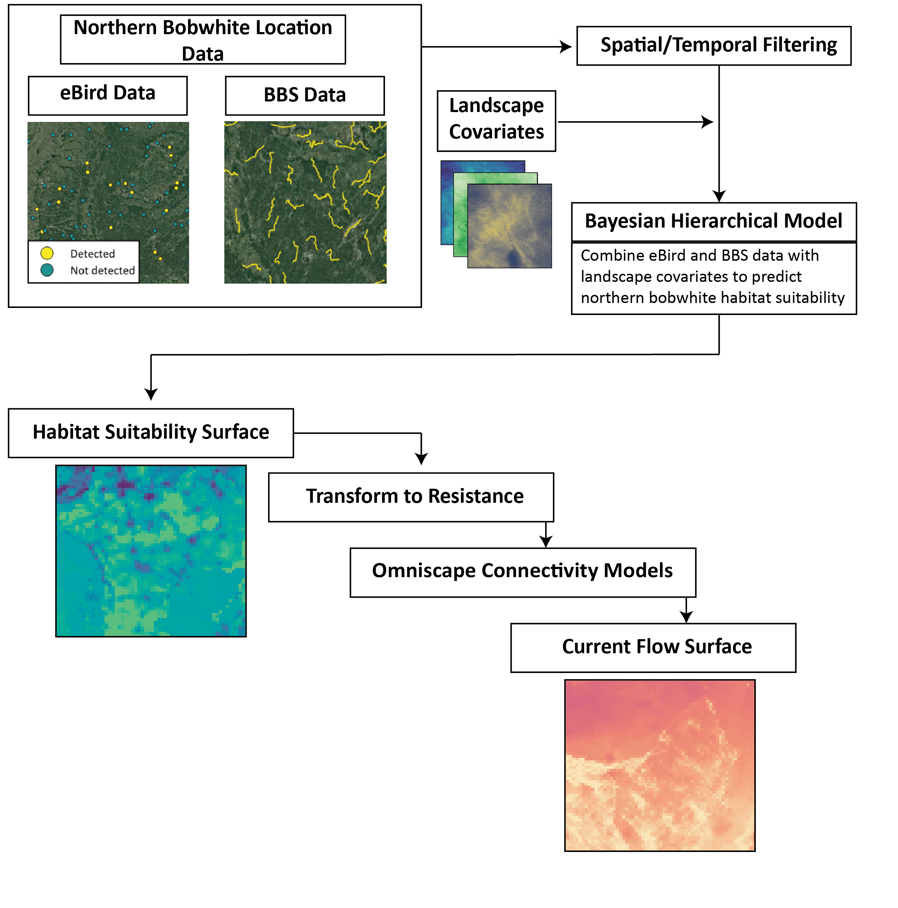

# Modeling range-wide habitat suitability and connectivity for the Northern Bobwhite

This is a working repository for the analysis of Bobwhite quail (*Colinus virginianus*) habitat suitability and connectivity.

**Repository maintainer(s):**

Patrick Freeman, Scientist, Conservation Science Partners, Inc.

Justin Suraci, Senior Scientist, Conservation Science Partners, Inc.

------------------------------------------------------------------------

# Overview

This repository contains the scripts and workflows used in a collaboration between Conservation Science Partners and researchers at the University of Georgia to develop novel range-wide models of habitat suitability and habitat connectivity to support ongoing Northern Bobwhite (*Colinus virginianus*) management and conservation efforts.

The Northern Bobwhite, despite substantial monitoring and conservation efforts, continues to face population declines across its range largely due to habitat fragmentation and degradation. Habitat fragmentation can also compromise landscape-scale connectivity, which supports important population processes including dispersal, migration, gene flow, and range shifts under climate change. Maintaining and enhancing existing areas of suitable habitat and high connectivity, both at the regional and range-wide scales, is thus an important pillar of a multi-pronged strategy for reversing bobwhite declines. 

[A full Technical Report that includes additional methodological details is available in a Google Cloud Storage bucket](https://storage.cloud.google.com/pf-bobwhite-deliverables/00-FINAL-DELIVERABLES/CSP-NOBO-Connectivity-TechReport-July2023.pdf). Access can be provided upon reasonable request.

## Analysis framework

We used count data from eBird, the Cornell Lab of Ornithology's community science platform, in combination with those obtained through structured surveys performed as part of the United States Geological Survey's (USGS) annual Breeding Bird Survey (BBS), to model habitat suitability across 42 states within the species' range using a hierarchical Bayesian modeling framework. We then used the suitability model to develop a set of circuit theory-based connectivity models at both the range-wide and regional scales. We note that this work represents the initial stages of an ongoing modeling effort aimed at identifying key areas across the bobwhite range for increased conservation-focused management. As such, results presented here should be considered preliminary and are subject to change as the underlying models continue to be refined.

### **Habitat Suitability Model**

To model bobwhite habitat suitability, we employed emerging statistical techniques for integrating data sources that differ in their structure, sampling protocols, and spatial distributions, leveraging these disparate data sources to predict species distribution patterns at large spatial scales. We used a hierarchical Bayesian modeling framework that integrated count data from relatively intensive, structured BBS surveys with those from the semi-structured, community science data available from the eBird platform, and modeled bobwhite abundance (a proxy for habitat suitability) as a function of covariates describing landscape-scale habitat variation and sampling effort. Due to the spatial resolution of the BBS data, we constructed our models at a spatial resolution of 5-km x 5-km, resulting in a raster output describing the relative density of bobwhite in each pixel.\

#### **Data and Code for Habitat Suitability Model**

##### **Location data inputs for habitat suitability model**

We pursued a modeling framework that integrated data from relatively intensive, structured surveys (i.e., USGS's BBS) with those from the semi-structured, community science data available from the eBird platform. We used count data from both surveys performed in 2018, 2019, and 2021. In order to estimate bobwhite abundance at a scale relevant to management, we summarized all bobwhite detections at 5 km. We created a grid comprised of 5-km x 5-km cells across the study area and calculated relative density within each grid cell as a proxy for habitat suitability (total number of grid cells = 187,856).\
\
*BBS Data*

We used the [2022 release of the North American Breeding Bird Survey (BBS) dataset](https://www.usgs.gov/data/2022-release-north-american-breeding-bird-survey-dataset-1966-2021). The raw data comes with 50 counts across 50 stops and the geographic location of the start of each route. To use all 50 point-count locations, we generated stops at 800m intervals from the starting point along each route and associated these 50 stops with their corresponding count data. Each of the stops is associated with a noise index (excluding car noise) and number of cars during survey time that can be used to model factors that impact detection probabilities.

**The script use for pre-processing the BBS data is here:**

*eBird Data*

We used data from the October 2022 release of the eBird Basic Dataset (EBD). The EBD is organized into "checklists", semi-structured surveys in which the observer records the species observed as well as variables associated with observation effort. We used checklists that occurred during May and June of 2018, 2019, and 2021 to temporally align with the time of BBS data collection. Datasets made available for use in research are subject to a rigorous pre-screening procedure (e.g., to remove false positives) and can be filtered to only include "complete" checklists, i.e., those in which the observer recorded all species detected. By using only complete checklists, eBird data provide information on both detections and non-detections of focal species, where non-detections are simply checklists in which the focal species was not observed ([Johnston et al. 2021](https://doi.org/10.1111/ddi.13271)).

We followed the best practices for using eBird data in scientific research described by Johnston et al. (2021) and Strimas-Mackey et al. ([2020](https://cornelllabofornithology.github.io/ebird-best-practices/)), conducting spatial subsampling to remove spatial bias, filtering data by observation effort to reduce variation in effort between checklists, and including effort covariates in our habitat suitability models to account for differences in detection probability between checklists.

We prepared eBird datasets using the *auk* package ([Strimas-Mackey et al. 2018](https://cornelllabofornithology.github.io/auk/)) in R. Data were first filtered to include all complete checklists. This ensures that non-detections can be inferred. We also filtered data based on observer effort to only include checklists that were \< 5 h in duration, \< 5 km in distance traveled, and performed by \< 10 observers (Schindler et al. 2022). We further applied spatial subsampling to mitigate spatial biases in sampling by dividing our dataset into two subsets: 1) checklists in which NOBO were not detected (count = 0), and 2) checklists in which at least one northern bobwhite was detected (count \>= 1). We then defined an equal area hexagonal grid across the northern bobwhite range, with \~5 km between the centroids of adjacent hexagons, using the R package *dggridR* ([Barnes and Sahr 2017](https://github.com/r-barnes/dggridR)). We randomly selected one checklist from subset 1 from each hexagon from each week in each calendar year. The resulting dataset was further processed to address class imbalance, which occurs when a species is detected on a very small proportion of checklists, resulting in vastly more non-detections than detections. We performed both undersampling and oversampling using the synthetic minority oversampling technique. This creates synthetic examples that occupy the parameter space between randomly chosen observations and their nearest neighbors so that the added observations are not direct copies but still fall within the same environmental space ([Chawla et al. 2002](https://doi.org/10.1613/jair.953)). For each checklist in this final pre-processed dataset we also retained information including the duration (in minutes), distance traveled (in km), survey type (stationary or traveling), and the number of observers that were used to model detection probabilities.

**The script for pre-processing the eBird dataset is here: xxxx**

##### **Input data summarization**

For the BBS dataset, we calculated the number of BBS stops and the observed bobwhite abundance per 5-km x 5-km grid cell, resulting in a total of 5,078 cells containing stops (number of stops per grid cell, range = 5-17; number of birds counted per grid cell = 0-13). For the EBD, we calculated the number of complete eBird checklists per 5-km x 5-km grid cell, resulting in a total of 24,054 grid cells with reported checklists (number of checklists per grid cell = 1-1,451) and the total number of northern bobwhite detections (number of detections = 0-30).

**The script use for preparing location data inputs is here: xxxxxx**

#### Environmental Covariates

We used a suite of covariates to model the impacts of environmental variation and land use on habitat suitability for bobwhite (see table below for covariate descriptions and links to relevant scripts). A full description of covariates and their descriptions is available in the [Technical Report](https://storage.cloud.google.com/pf-bobwhite-deliverables/00-FINAL-DELIVERABLES/CSP-NOBO-Connectivity-TechReport-July2023.pdf).

**Covariate tiffs and GEE-based tabular extractions are available in a [Google Cloud Storage bucket](https://console.cloud.google.com/storage/browser/pf-bobwhite-storage/02-output-data?project=pf-bobwhite&pageState=(%22StorageObjectListTable%22:(%22f%22:%22%255B%255D%22))&prefix=&forceOnObjectsSortingFiltering=false).**

**The script used to extract covariate values to 5-km grid cells and assemble them for habitat suitability modeling is here:** [bobwhite-covariate-grid-assembly.R](https://github.com/csp-inc/pf-bobwhite/blob/main/code/bobwhite-covariate-grid-assembly.R)

| Covariate category       | Covariate                                                                       | Source                                                                                                                                                                                                         | Date       | Native Resolution                | Script(s) used for derivation                                                                                                                                                                                                                   |
|------------|------------|------------|------------|------------|------------|
| Topography               | Elevation                                                                       | [ALOS Global DSM (AW3D)](https://developers.google.com/earth-engine/datasets/catalog/JAXA_ALOS_AW3D30_V3_2)                                                                                                    | 2021       | 30m                              | [bobwhite-sdm-covariate-construction.ipynb](https://github.com/csp-inc/pf-bobwhite/blob/main/code/bobwhite-sdm-covariate-construction.ipynb)                                                                                                    |
| Topography               | Slope                                                                           | [ALOS Global DSM (AW3D)](https://developers.google.com/earth-engine/datasets/catalog/JAXA_ALOS_AW3D30_V3_2)                                                                                                    | 2021       | 30m                              | [bobwhite-sdm-covariate-construction.ipynb](https://github.com/csp-inc/pf-bobwhite/blob/main/code/bobwhite-sdm-covariate-construction.ipynb)                                                                                                    |
| Topography               | Aspect                                                                          | [ALOS Global DSM (AW3D)](https://developers.google.com/earth-engine/datasets/catalog/JAXA_ALOS_AW3D30_V3_2)                                                                                                    | 2021       | 30m                              | [bobwhite-sdm-covariate-construction.ipynb](https://github.com/csp-inc/pf-bobwhite/blob/main/code/bobwhite-sdm-covariate-construction.ipynb)                                                                                                    |
| Climate                  | Mean daily maximum temperature                                                  | [NASA Daymet V4](https://developers.google.com/earth-engine/datasets/catalog/NASA_ORNL_DAYMET_V4)                                                                                                              | 2016-2021  | 1000m                            | [bobwhite-sdm-covariate-construction.ipynb](https://github.com/csp-inc/pf-bobwhite/blob/main/code/bobwhite-sdm-covariate-construction.ipynb)                                                                                                    |
| Climate                  | Mean daily precipitation                                                        | [NASA Daymet V4](https://developers.google.com/earth-engine/datasets/catalog/NASA_ORNL_DAYMET_V4)                                                                                                              | 2016-2021  | 1000m                            | [bobwhite-sdm-covariate-construction.ipynb](https://github.com/csp-inc/pf-bobwhite/blob/main/code/bobwhite-sdm-covariate-construction.ipynb)                                                                                                    |
| Climate                  | Days with snow depth \> 2.5cm                                                   | [SNODAS](https://nsidc.org/data/g02158/versions/1#anchor-1)                                                                                                                                                    | 2016-2021  | 1000m                            | [snow-depth-days-covariate-construction.R](https://github.com/csp-inc/pf-bobwhite/blob/main/code/utils/snow-depth-days-covariate-construction.R)                                                                                                |
| Land cover               | Proportional cover bare ground                                                  | [Rangeland Analysis Platform](https://rangelands.app/support/61-processing-rap-data-in-google-earth-engine)                                                                                                    | 2016-2021  | 30m                              | [bobwhite-sdm-covariate-construction.ipynb](https://github.com/csp-inc/pf-bobwhite/blob/main/code/bobwhite-sdm-covariate-construction.ipynb)                                                                                                    |
| Land cover               | Proportional cover perennial forbs and grass                                    | [Rangeland Analysis Platform](https://rangelands.app/support/61-processing-rap-data-in-google-earth-engine)                                                                                                    | 2016-2021  | 30m                              | [bobwhite-sdm-covariate-construction.ipynb](https://github.com/csp-inc/pf-bobwhite/blob/main/code/bobwhite-sdm-covariate-construction.ipynb)                                                                                                    |
| Land cover               | Proportional cover of shrubs                                                    | [Rangeland Analysis Platform](https://rangelands.app/support/61-processing-rap-data-in-google-earth-engine)                                                                                                    | 2016-2021  | 30m                              | [bobwhite-sdm-covariate-construction.ipynb](https://github.com/csp-inc/pf-bobwhite/blob/main/code/bobwhite-sdm-covariate-construction.ipynb)                                                                                                    |
| Land cover               | Proportional cover of trees                                                     | [Rangeland Analysis Platform](https://rangelands.app/support/61-processing-rap-data-in-google-earth-engine)                                                                                                    | 2016-2021  | 30m                              | [bobwhite-sdm-covariate-construction.ipynb](https://github.com/csp-inc/pf-bobwhite/blob/main/code/bobwhite-sdm-covariate-construction.ipynb)                                                                                                    |
| Land cover               | Percent cover rowcrop                                                           | [National Land Cover Dataset (NLCD)](https://developers.google.com/earth-engine/datasets/catalog/USGS_NLCD_RELEASES_2019_REL_NLCD)                                                                             | 2016, 2019 | 30m                              | [bobwhite-sdm-covariate-construction.ipynb](https://github.com/csp-inc/pf-bobwhite/blob/main/code/bobwhite-sdm-covariate-construction.ipynb)                                                                                                    |
| Land cover               | Percent cover pasture                                                           | [National Land Cover Dataset (NLCD)](https://developers.google.com/earth-engine/datasets/catalog/USGS_NLCD_RELEASES_2019_REL_NLCD)                                                                             | 2016, 2019 | 30m                              | [bobwhite-sdm-covariate-construction.ipynb](https://github.com/csp-inc/pf-bobwhite/blob/main/code/bobwhite-sdm-covariate-construction.ipynb)                                                                                                    |
| Landscape structure      | Surface roughness - proportional cover of perennial forbs and grass             | This study                                                                                                                                                                                                     | 2016-2019  | 270m                             | [geodiv-parallel-calculations.R](https://github.com/csp-inc/pf-bobwhite/blob/main/code/utils/geodiv-parallel-calculations.R) [mosaic-gradient-rasters.R](https://github.com/csp-inc/pf-bobwhite/blob/main/code/utils/mosaic-gradient-rasters.R) |
| Landscape structure      | Surface roughness - proportional cover of trees                                 | This study                                                                                                                                                                                                     | 2016-2019  | 270m                             | [geodiv-parallel-calculations.R](https://github.com/csp-inc/pf-bobwhite/blob/main/code/utils/geodiv-parallel-calculations.R) [mosaic-gradient-rasters.R](https://github.com/csp-inc/pf-bobwhite/blob/main/code/utils/mosaic-gradient-rasters.R) |
| Land use and disturbance | Urban land use intensity                                                        | [Suraci et al. 2023](https://www.sciencedirect.com/science/article/pii/S0006320722004499)                                                                                                                      | 2016       | 250m                             | [bobwhite-sdm-covariate-construction.ipynb](https://github.com/csp-inc/pf-bobwhite/blob/main/code/bobwhite-sdm-covariate-construction.ipynb)                                                                                                    |
| Land use and disturbance | Transportation land use intensity                                               | [Suraci et al. 2023](https://www.sciencedirect.com/science/article/pii/S0006320722004499)                                                                                                                      | 2016       | 250m                             | [bobwhite-sdm-covariate-construction.ipynb](https://github.com/csp-inc/pf-bobwhite/blob/main/code/bobwhite-sdm-covariate-construction.ipynb)                                                                                                    |
| Land use and disturbance | Proportion of county area under relevant Conservation Reserve Program practices | [USDA](https://www.fsa.usda.gov/programs-and-services/conservation-programs/reports-and-statistics/conservation-reserve-program-statistics/index#:~:text=CRP%20Practices%20(Acres)%20By%20County%20Jan%202020) | 2017       | Polygon data rasterized at 5000m | [crp-acreage-raster-construction.R](https://github.com/csp-inc/pf-bobwhite/blob/main/code/utils/crp-acreage-raster-construction.R)                                                                                                              |
| Land use and disturbance | Average farm size                                                               | [USDA](http://quickstats.nass.usda.gov/)                                                                                                                                                                       | 2017       | Polygon data rasterized at 5000m | [average-farm-size-raster-construction.R](https://github.com/csp-inc/pf-bobwhite/blob/main/code/utils/average-farm-size-raster-construction.R)                                                                                                  |
| Land use and disturbance | Fire frequency                                                                  | [Monitoring Trends in Burn Severity (MTBS) Interagency Program](https://www.mtbs.gov/direct-download)                                                                                                          | 2006-2021  | Polygon data rasterized at 5000m | [mtbs-rasterization.R](https://github.com/csp-inc/pf-bobwhite/blob/main/code/utils/mtbs-rasterization.R)                                                                                                                                        |

#### Hierarchical Bayesian Habitat Suitability Model

We used a hierarchical Bayesian framework to develop and fit a model that jointly analyzed the BBS and eBird datasets through the integration of a joint abundance likelihood process, but taking into account the different detection processes unique to each of the input datasets. The ultimate output of this suitability model was an estimate of the relative density of bobwhite in each grid cell. For a full description of the model structure is provided in the project's [Technical Report](https://storage.cloud.google.com/pf-bobwhite-deliverables/00-FINAL-DELIVERABLES/CSP-NOBO-Connectivity-TechReport-July2023.pdf).

**The script used to fit the hierarchical Bayesian model is here:** xxxxx

### Connectivity Modeling

Using the range-wide habitat suitability model described above, we built omnidirectional connectivity models using the Omniscape algorithm ([McRae et al. 2016](https://kleinex.mit.edu/~edelman/publications/circuitscape.pdf), [Landau et al. 2021](https://scholar.google.com/scholar?hl=en&as_sdt=0%2C5&q=mcrae+omniscape&btnG=#:~:text=Omniscape.%20jl%3A%20Software%20to%20compute%20omnidirectional%20landscape%20connectivity)), a circuit theory-based approach that models the movement of organisms across the landscape as a flow of electrical current through a circuit ([McRae et al. 2008](https://esajournals.onlinelibrary.wiley.com/doi/abs/10.1890/07-1861.1), [Dickson et al. 2019](https://conbio.onlinelibrary.wiley.com/doi/abs/10.1111/cobi.13230)). In these models, current flow provides an estimate of the probability or intensity of the movement of organisms through every pixel on the landscape. Omniscape models 'coreless' connectivity in which every pixel can serve as both a source and/or a target of potential movement, thus allowing current to potentially flow in all directions. Inputs for Omniscape models include a source strength surface, describing the predicted probability or intensity of movement from a given location, and a landscape resistance surface, which estimates the difficulty an animal experiences in moving through each pixel on the landscape ([Zeller et al. 2012](https://link.springer.com/article/10.1007/s10980-012-9737-0)). The habitat suitability model outlined above served as the basis for the construction of both source and resistance layers in our models. We developed five connectivity models, including a range-wide model (encompassing 42 states across the bobwhite range) and regional models based on the USDA's Agricultural Research Service (ARS) regions.

We used the output of the habitat suitability model described above to derive two input layers for each connectivity model: source strength (the predicted probability or intensity of movement from a given location) and landscape resistance (the difficulty an animal experiences in moving through each pixel on the landscape). For both input layers, we first clamped the habitat suitability surface to the 99th percentile of predicted values (502 bobwhite/25km2) to remove outlier values that would otherwise skew the distribution of predicted bobwhite relative densities. To derive source strength, we first applied a natural logarithm transformation to habitat suitability further highlighting potential variation in abundance, and then rescaled this layer to have values ranging from 0 (no source strength) to 1 (maximum source strength) using a standard min-max normalization based on the range of values within the extent of the model (e.g. range-wide or only values within a particular region, as appropriate). To generate resistance layers, we followed Keeley et al. ([2016](https://link.springer.com/article/10.1007/s10980-016-0387-5)) and used a negative exponential function to transform the abundance layer into landscape resistance, R, via the following equation:

R = 100 - 99 \* ((1 - exp(-c \* h)) / (1 - exp(-c))),

where h is the habitat suitability value at a given pixel and c is a constant that determines the degree of nonlinearity between h and R. Lower values of c produce linear or nearly linear relationships between h and R, while higher values of c produce increasingly non-linear relationships such that resistance declines more quickly with increasing values of habitat suitability. Following guidance by Keeley et al. ([2016](https://link.springer.com/article/10.1007/s10980-016-0387-5)), we chose a c value resulting in a moderately non-linear relationship between h and R (c = 8).

The Omniscape algorithm uses a moving window approach, iteratively treating every pixel in the source strength layer with a value greater than zero as a target for electrical current and connecting that pixel to all other non-zero pixels within the moving window radius, which serve as current sources. The moving window size thus sets the maximum distance between movement start and end points. Here we used a moving window radius of 250 km, representing the potential movement of bobwhite over several generations. This moving window radius was determined to be appropriate given both the relatively coarse nature of raster inputs (5-km x 5-km) and the objective of identifying important areas for conserving or enhancing bobwhite connectivity over large spatial scales (i.e., regionally rather than locally important connectivity areas).

**The script used to prepare the source and resistance inputs for all connectivity models is here: [prep-omniscape-inputs.R](https://github.com/csp-inc/pf-bobwhite/blob/main/code/connectivity/prep-omniscape-inputs.R)**

Necessary inputs (e.g. the habitat suitability model surface, the model AOI, and the different ARS regions) for these scripts are available in the [connectivity-data folder](https://github.com/csp-inc/pf-bobwhite/tree/main/connectivity-data).

Source and resistance layers are placed in the [omniscape-inputs folder](https://github.com/csp-inc/pf-bobwhite/tree/main/connectivity-data/omniscape-inputs).

Connectivity models were run in Julia on a Google Cloud Services Virtual Machine. A Docker Image containing the necessary components for building the Omniscape container is [here](docker).

Omniscape can be initialized from the command-line using the r[un_omniscape.sh bash file](run_omniscape.sh).

Omniscape outputs are stored in the [omniscape-outputs folder](https://github.com/csp-inc/pf-bobwhite/tree/main/connectivity-data/omniscape-outputs).
